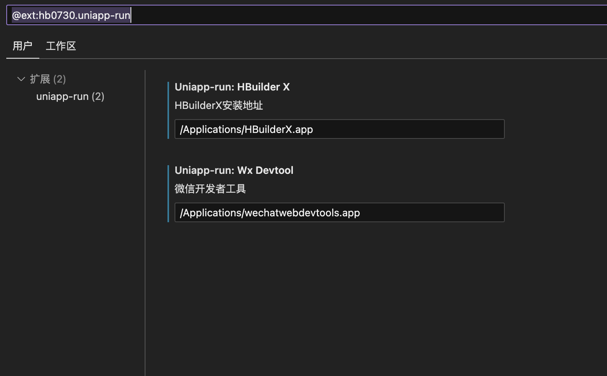
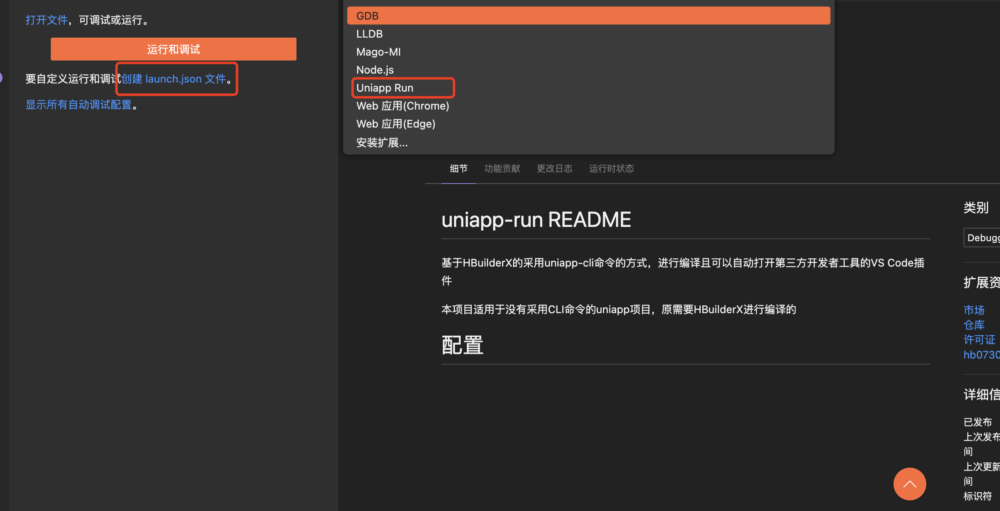
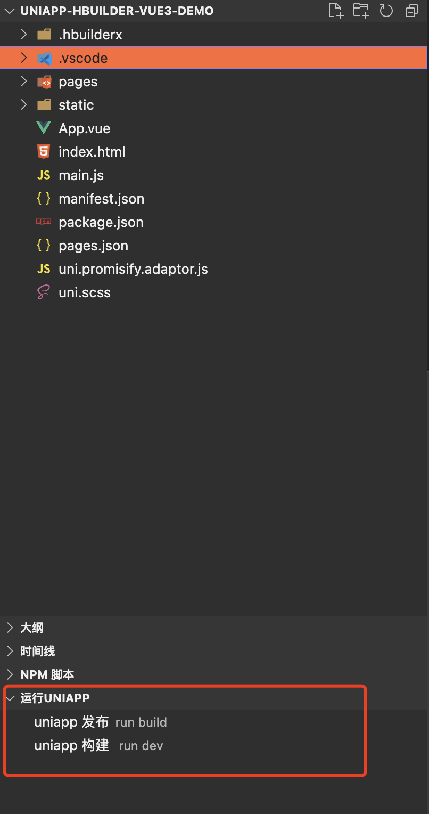

# uniapp-run README

基于HBuilderX的采用uniapp-cli命令的方式，进行编译且可以自动打开第三方开发者工具的VS Code插件

本项目适用于没有采用CLI命令的uniapp项目，原需要HBuilderX进行编译的


## 配置

### 开发者工具&HBuilderX配置



### launch.json 配置

如果第一次使用可以使用默认模版方式快速创建`launch.json`


`launch.json` 参数

```json
{
    "type": "uniapp-run",
    "request": "launch",
    "name": "Uniapp Run",
    "platform": "mp-weixin"
}
```

* `type`: 必须是 `uniapp-run`
* `request`: 必须是: `launch`
* `name`: 随便填写
* `platform`: 编译成的平台，与uniapp基本保持一致: `mp-weixin`,`mp-alipay`,`mp-baidu`等
* `src`: 项目路径，默认当前项目路径
* `compress`: 是否运行时压缩
* `openDevTool`: 是否自动打开第三方开发者工具
* `vueVersion`: vue版本，目前支持`2`和`3`，默认`2`

## 命令方式

* `uniapp-run.run`: 运行uniapp项目
* `uniapp-run.publish`: 发布uniapp项目



## 支持打开第三方开发者工具

* 微信开发者工具

## 推荐

### Vs Code

* [uni-helper-vscode](https://marketplace.visualstudio.com/items?itemName=uni-helper.uni-helper-vscode) 增强 uni-app 系列产品在 VSCode 内的体验。
* [create-uniapp-view](https://marketplace.visualstudio.com/items?itemName=mrmaoddxxaa.create-uniapp-view) 在 VS Code 右键目录文件夹快速创建页面与组建，创建视图页面时将自动添加 pages.json 中！
* [evils.uniapp-vscode](https://marketplace.visualstudio.com/items?itemName=evils.uniapp-vscode) 一个灵活、好用、持续维护的uniapp小程序拓展 **如果使用的hbuildx方式且vue2的强烈推荐**

## JetBrains 插件

* [uniapp-support](https://plugins.jetbrains.com/plugin/19675-uniapp-support) 适用于JetBrains家族的uniapp插件
